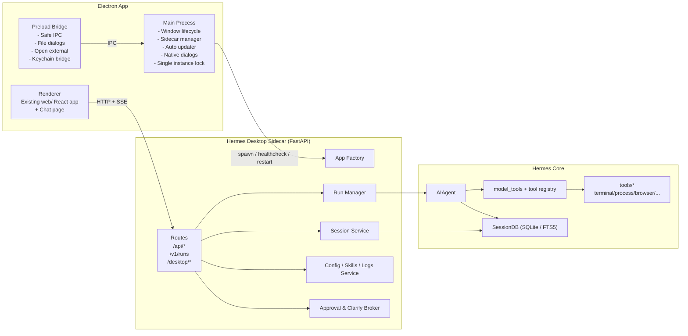
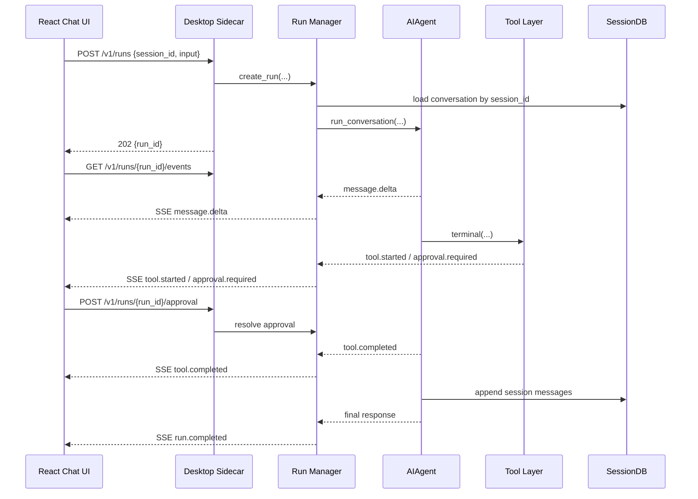
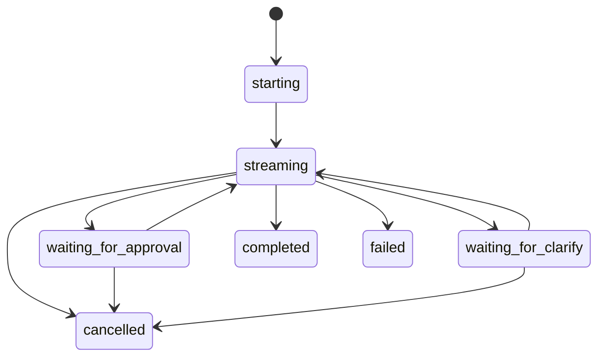

# Hermes Desktop v1.0 技术设计文档

Date: 2026-04-13

Status: Draft

## 1. 文档目标

本文定义 `Hermes Desktop v1.0` 的技术方案。目标产品形态为：

- `Electron` 桌面壳
- 继续扩展现有 `web/` React 前端，补齐真正的 Chat 体验
- 本地单实例 `Hermes Sidecar`
- 通过 `AIAgent` 复用 Hermes 现有 agent 内核、工具系统、会话存储与日志能力
- 安装后无需用户手动安装 Python、Node、FastAPI、Chromium 或其他依赖
- 首发支持 `Windows` 与 `macOS`

设计原则是“最大化复用 Hermes 已有内核，最小化重写 CLI 专属交互层”。

## 2. 现有代码基础

Hermes 已具备桌面化所需的大部分基础能力：

| 能力 | 现状 | 设计含义 |
|---|---|---|
| Agent 内核 | `AIAgent` 已是 headless，同步 conversation loop + 多类 callback | 桌面 UI 无需复用 CLI，本地 sidecar 直接驱动 agent |
| 实时流式输出 | 已支持 `stream_delta_callback`、`tool_progress_callback`、`thinking_callback`、`clarify_callback`、`status_callback` | 可以直接映射为桌面聊天流、时间线、审批与澄清卡片 |
| 工具系统 | `tools/registry.py` + `model_tools.py` 基于注册表发现与调度 | 不需要为桌面版单独发明 tool runtime |
| 会话存储 | `SessionDB` 已支持会话、消息、FTS5 搜索 | 可以用 `session_id` 驱动桌面历史与恢复 |
| 现有 Web 管理页 | `hermes_cli/web_server.py` 已提供 `/api/status`、`/api/sessions`、`/api/logs`、`/api/skills` 等 | 配置/会话/日志/技能页可直接复用 |
| 现有流式 API | `gateway/platforms/api_server.py` 已有 `/v1/runs` + SSE 事件流 | Chat 协议优先复用，不另起炉灶 |
| 浏览器工具 | `tools/browser_tool.py` 已支持本地 Node/browser runtime 探测 | 桌面版可内置 Node/Chromium，避免用户手动安装 |

## 3. 目标与约束

### 3.1 目标

1. 提供一款真正“安装即用”的 Hermes 桌面客户端。
2. 将 Hermes 的核心优势从 CLI 平移到桌面：
   - 工具透明执行
   - 会话可恢复
   - coding/workspace 优先
   - 真实审批与澄清
3. 桌面版与现有 Hermes 共享同一套 agent core、tool registry、SessionDB、配置与技能体系。
4. 构建链路使用 GitHub Actions 自动产出安装包。

### 3.2 非目标

- 不在 v1.0 首发 Linux
- 不把所有 gateway messaging 平台能力塞进桌面产品
- 不把 CLI 包一层壳当成桌面版
- 不在 v1.0 支持多人远程协作或远程托管 sidecar

### 3.3 关键约束

1. 桌面版必须延续现有 `web/` React 前端。
2. 聊天协议优先复用 `/v1/runs + SSE`。
3. `配置/会话/日志/技能` 继续复用当前 `web_server` 的 API 面。
4. 需要显式支持审批、澄清、取消，而不是依赖纯文本回合。
5. 必须保持 prompt caching 友好，避免中途频繁重建 system prompt 或乱改 toolsets。

## 4. 架构决策

### ADR-01: 使用“单 sidecar、单端口、单入口”

`v1.0` 不同时运行当前 `hermes_cli/web_server.py` 与 `gateway/platforms/api_server.py` 两个本地服务。

原因：

- 双服务会带来端口管理、跨服务状态同步、启动顺序与调试复杂度
- 桌面端需要一个统一的本地控制面
- Electron 更适合只面向一个本地 sidecar 做健康检查、重启和鉴权

结论：

- 新建统一的 `Hermes Desktop Sidecar`
- 继续使用 `FastAPI` 作为本地 HTTP 服务框架
- 把当前 `web_server` 的 `/api/*` 路由与 `api_server` 的 `/v1/runs` 能力抽到共享服务层，再挂载到同一个应用

### ADR-02: 不复用 CLI UI，只复用 CLI 之下的核心层

不把 `cli.py` 或 `prompt_toolkit` 交互封装进桌面版。

复用层应为：

- `AIAgent`
- `SessionDB`
- tool registry / toolsets
- provider/runtime resolution
- 现有 Web 管理 API
- `/v1/runs` 事件模型

### ADR-03: 桌面版以 `session_id` 为对话主键

`/v1/runs` 当前允许显式传 `conversation_history`，但桌面聊天不应该每次把完整历史回传给后端。

结论：

- `session_id` 是桌面版会话主键
- run 创建时只传本轮输入与会话标识
- sidecar 从 `SessionDB` 读取历史并续跑
- 会话列表、恢复、搜索、删除全部围绕 `SessionDB`

### ADR-04: 审批与澄清是事件化能力，不是“文本回合技巧”

桌面版需要一等公民的：

- `approval.required`
- `approval.resolved`
- `clarify.required`
- `clarify.resolved`
- `run.cancelled`

这要求 sidecar 对 `terminal_tool`、`clarify` 工具与 agent callback 增加桥接层。

### ADR-05: 桌面运行时完全内置

面向用户的安装包中必须包含：

- Python sidecar 运行时
- Hermes Python 依赖
- `web_dist`
- Node runtime
- `agent-browser`
- Chromium 或首启自动 provision 机制

不允许出现“先装 Python / npm / Node 再回来配置”的用户路径。

## 5. 总体架构



### 5.1 运行时数据流



## 6. 模块设计

### 6.1 Electron Main Process

职责：

- 应用启动与单实例锁
- sidecar 生命周期管理
- 选择可用 localhost 端口
- 健康检查、崩溃重启
- 自动更新
- 文件选择器、打开目录、Reveal in Finder/Explorer
- 可选的 OS keychain 集成

建议模块：

```text
desktop/electron/src/main/
  index.ts
  app.ts
  window.ts
  sidecar.ts
  updater.ts
  protocol.ts
  keychain.ts
  logging.ts
```

### 6.2 Preload Bridge

职责：

- 暴露最小 IPC 面给 renderer
- 屏蔽 `fs`, `child_process`, `shell` 等高权限能力
- 提供安全的目录选择、路径 reveal、外链打开、更新状态读取

不把 agent 逻辑放进 preload。

### 6.3 React Renderer

职责：

- 基于现有 `web/` 页面扩展出桌面主界面
- 新增 `ChatPage`、`OnboardingPage`、`WorkspacePicker`
- 通过 HTTP/SSE 与 sidecar 通信
- 通过 preload IPC 获取本地能力

建议保留现有 visual language，不重写整套设计系统。

### 6.4 Desktop Sidecar

职责：

- 统一 HTTP 服务
- 静态托管 `web_dist`
- 暴露 `web_server` 风格管理接口
- 暴露 `/v1/runs + SSE`
- 维护 run 生命周期、审批/澄清 pending 状态

建议抽取共享服务包而不是继续把逻辑堆在 `hermes_cli/web_server.py` 内：

```text
hermes_server/
  __init__.py
  app_factory.py
  auth.py
  settings.py
  routes/
    status.py
    sessions.py
    config.py
    logs.py
    skills.py
    runs.py
    desktop.py
  services/
    run_manager.py
    run_events.py
    session_service.py
    provider_setup.py
    browser_runtime.py
    sidecar_state.py
```

### 6.5 Run Manager

职责：

- `run_id` 分配
- 事件队列与 `seq` 编号
- run 状态机
- 把 agent callback 映射成 SSE 事件
- 管理 pending approval / clarify 请求
- 支持取消、失败清理和 orphan sweep

建议将当前 `gateway/platforms/api_server.py` 的 `/v1/runs` 核心逻辑迁出为共享服务。

### 6.6 Approval & Clarify Broker

职责：

- 把 `terminal_tool` 的危险命令审批回调事件化
- 把 `clarify` 工具或 `clarify_callback` 事件化
- 为同一个 `run_id` 维护 pending request map
- 支持 renderer 异步提交结果后继续运行

### 6.7 Session Service

职责：

- 创建空会话
- 基于 `session_id` 恢复消息历史
- 查询最近会话、搜索、删除
- 管理工作区路径、标题、来源与最后活跃时间

### 6.8 Runtime Asset Manager

职责：

- 检查 Node runtime / `agent-browser` / Chromium 是否齐全
- 首启时准备桌面 runtime 目录
- 上报安装状态给 onboarding 与设置页

## 7. 目录结构

建议的 v1.0 目录结构如下：

```text
desktop/
  electron/
    package.json
    electron-builder.yml
    tsconfig.json
    src/
      main/
        index.ts
        sidecar.ts
        updater.ts
        keychain.ts
        window.ts
      preload/
        index.ts
    scripts/
      bundle-sidecar.mjs
      copy-runtime-assets.mjs
      notarize.mjs
    resources/
      entitlements.mac.plist
      icon.icns
      icon.ico

hermes_server/
  __init__.py
  app_factory.py
  desktop_entry.py
  auth.py
  settings.py
  routes/
    status.py
    sessions.py
    config.py
    logs.py
    skills.py
    runs.py
    desktop.py
  services/
    run_manager.py
    run_events.py
    session_service.py
    approval_bridge.py
    clarify_bridge.py
    browser_runtime.py
    onboarding.py

web/
  src/
    App.tsx
    pages/
      ChatPage.tsx
      OnboardingPage.tsx
      SessionsPage.tsx
      LogsPage.tsx
      SkillsPage.tsx
      ConfigPage.tsx
    components/chat/
      ChatComposer.tsx
      MessageList.tsx
      TimelinePanel.tsx
      ApprovalCard.tsx
      ClarifyCard.tsx
      RunStatusBar.tsx
      SessionSidebar.tsx
    hooks/
      useRunStream.ts
      useSessionList.ts
      useOnboarding.ts
    lib/
      api.ts
      runs.ts
      desktop.ts
```

### 7.1 兼容性策略

- `web/src/` 继续作为前端唯一源代码目录
- `hermes_cli/web_dist` 仍作为前端构建产物目录
- 现有 `hermes_cli/web_server.py` 在迁移期可保留为兼容入口，但最终应变薄，只负责调用共享 `app_factory`

## 8. HTTP 接口清单

### 8.1 继续复用的接口

以下接口保持语义兼容，桌面版直接复用：

| Method | Path | 用途 |
|---|---|---|
| `GET` | `/api/status` | sidecar / 版本 / 配置状态 |
| `GET` | `/api/sessions` | 最近会话列表 |
| `GET` | `/api/sessions/search` | 会话全文检索 |
| `GET` | `/api/sessions/{session_id}` | 单个会话元数据 |
| `GET` | `/api/sessions/{session_id}/messages` | 会话消息历史 |
| `DELETE` | `/api/sessions/{session_id}` | 删除会话 |
| `GET` | `/api/config` | 获取配置 |
| `PUT` | `/api/config` | 保存配置 |
| `GET` | `/api/config/defaults` | 配置默认值 |
| `GET` | `/api/config/schema` | 动态表单 schema |
| `GET` | `/api/config/raw` | 原始 YAML 配置 |
| `PUT` | `/api/config/raw` | 保存原始 YAML |
| `GET` | `/api/logs` | 查看日志 |
| `GET` | `/api/skills` | 技能列表 |
| `PUT` | `/api/skills/toggle` | 启用/禁用技能 |
| `GET` | `/api/tools/toolsets` | toolset 配置 |
| `GET` | `/api/analytics/usage` | 使用统计 |
| `GET` | `/api/cron/jobs` 等 | cron 管理 |

### 8.2 新增 desktop bootstrap 接口

#### `GET /desktop/bootstrap`

首屏初始化数据，减少 renderer 并发请求数量。

响应：

```json
{
  "app": {
    "name": "Hermes Desktop",
    "version": "1.0.0",
    "platform": "darwin",
    "build_channel": "stable"
  },
  "sidecar": {
    "healthy": true,
    "port": 51791,
    "profile": "desktop-default"
  },
  "onboarding": {
    "completed": false,
    "provider_configured": false,
    "default_model": "",
    "workspace": null
  },
  "runtime": {
    "python_ready": true,
    "browser_runtime_ready": true,
    "node_ready": true
  }
}
```

#### `POST /desktop/onboarding/complete`

保存首启结果。

请求：

```json
{
  "provider": "openrouter",
  "model": "anthropic/claude-sonnet-4.6",
  "workspace": "/Users/alice/projects",
  "approval_mode": "ask"
}
```

### 8.3 新增 chat/session 接口

#### `POST /api/sessions`

创建桌面聊天会话。

请求：

```json
{
  "cwd": "/Users/alice/projects/hermes",
  "title": "New Chat",
  "source": "desktop"
}
```

响应：

```json
{
  "session_id": "desktop_3c69d2f1",
  "created": true
}
```

#### `PATCH /api/sessions/{session_id}`

更新标题、工作区或固定状态。

请求：

```json
{
  "title": "Fix browser tool packaging",
  "cwd": "/Users/alice/projects/hermes"
}
```

### 8.4 `/v1/runs` 接口

#### `POST /v1/runs`

创建一个 run 并立即返回 `202 Accepted`。

请求：

```json
{
  "session_id": "desktop_3c69d2f1",
  "input": "帮我分析 browser tool 打包问题并给出修复方案",
  "cwd": "/Users/alice/projects/hermes",
  "model": "anthropic/claude-sonnet-4.6",
  "instructions": null,
  "toolset": "hermes-desktop",
  "client": {
    "name": "hermes-desktop",
    "version": "1.0.0"
  }
}
```

响应：

```json
{
  "run_id": "run_95c64f3b9f7f4b3db3fd",
  "session_id": "desktop_3c69d2f1",
  "status": "started"
}
```

#### `GET /v1/runs/{run_id}/events`

SSE 事件流，支持：

- `message.delta`
- `reasoning.available`
- `tool.started`
- `tool.completed`
- `approval.required`
- `approval.resolved`
- `clarify.required`
- `clarify.resolved`
- `run.completed`
- `run.failed`
- `run.cancelled`

协议约定：

- `Content-Type: text/event-stream`
- 30 秒 keepalive comment
- 事件按 `seq` 严格递增
- 关闭前发送 `: stream closed`

#### `GET /v1/runs/{run_id}`

读取当前 run 状态。

响应：

```json
{
  "run_id": "run_95c64f3b9f7f4b3db3fd",
  "session_id": "desktop_3c69d2f1",
  "status": "waiting_for_approval",
  "started_at": 1776048226.128,
  "last_event_seq": 8
}
```

#### `POST /v1/runs/{run_id}/cancel`

取消 run。

请求：

```json
{
  "reason": "user_cancelled"
}
```

#### `POST /v1/runs/{run_id}/approval`

提交审批结果。

请求：

```json
{
  "request_id": "apr_5ab2f0d4",
  "decision": "allow_once",
  "remember": false
}
```

`decision` 枚举：

- `allow_once`
- `allow_session`
- `allow_workspace`
- `deny`

#### `POST /v1/runs/{run_id}/clarify`

提交澄清问题答案。

请求：

```json
{
  "request_id": "clr_05ef1d3e",
  "answer": "只修改打包方案，不动现有 tool API"
}
```

## 9. SSE 事件 Schema

### 9.1 通用事件结构

v1.0 保持与现有 `/v1/runs` 风格兼容，继续使用扁平 JSON 事件；在此基础上统一补充：

- `session_id`
- `seq`
- `timestamp`

通用字段：

```json
{
  "event": "tool.started",
  "run_id": "run_95c64f3b9f7f4b3db3fd",
  "session_id": "desktop_3c69d2f1",
  "seq": 5,
  "timestamp": 1776048228.551
}
```

### 9.2 事件定义

#### `run.started`

```json
{
  "event": "run.started",
  "run_id": "run_95c64f3b9f7f4b3db3fd",
  "session_id": "desktop_3c69d2f1",
  "seq": 1,
  "timestamp": 1776048226.128,
  "model": "anthropic/claude-sonnet-4.6",
  "cwd": "/Users/alice/projects/hermes"
}
```

#### `message.delta`

```json
{
  "event": "message.delta",
  "run_id": "run_95c64f3b9f7f4b3db3fd",
  "session_id": "desktop_3c69d2f1",
  "seq": 7,
  "timestamp": 1776048229.103,
  "delta": "我先检查当前 browser runtime 的打包路径。"
}
```

#### `reasoning.available`

```json
{
  "event": "reasoning.available",
  "run_id": "run_95c64f3b9f7f4b3db3fd",
  "session_id": "desktop_3c69d2f1",
  "seq": 4,
  "timestamp": 1776048228.101,
  "text": "Need to inspect browser_tool lookup and packaging paths."
}
```

#### `tool.started`

```json
{
  "event": "tool.started",
  "run_id": "run_95c64f3b9f7f4b3db3fd",
  "session_id": "desktop_3c69d2f1",
  "seq": 5,
  "timestamp": 1776048228.551,
  "tool": "terminal",
  "call_id": "call_8a2f",
  "preview": "rg -n \"agent-browser\" tools/browser_tool.py"
}
```

#### `tool.completed`

```json
{
  "event": "tool.completed",
  "run_id": "run_95c64f3b9f7f4b3db3fd",
  "session_id": "desktop_3c69d2f1",
  "seq": 6,
  "timestamp": 1776048228.993,
  "tool": "terminal",
  "call_id": "call_8a2f",
  "duration": 0.442,
  "error": false
}
```

#### `approval.required`

```json
{
  "event": "approval.required",
  "run_id": "run_95c64f3b9f7f4b3db3fd",
  "session_id": "desktop_3c69d2f1",
  "seq": 8,
  "timestamp": 1776048229.900,
  "request_id": "apr_5ab2f0d4",
  "tool": "terminal",
  "title": "Dangerous command requires approval",
  "description": "This command may modify files outside the workspace.",
  "risk_level": "high",
  "command": "rm -rf build",
  "cwd": "/Users/alice/projects/hermes",
  "options": [
    "allow_once",
    "allow_session",
    "allow_workspace",
    "deny"
  ]
}
```

#### `approval.resolved`

```json
{
  "event": "approval.resolved",
  "run_id": "run_95c64f3b9f7f4b3db3fd",
  "session_id": "desktop_3c69d2f1",
  "seq": 9,
  "timestamp": 1776048234.011,
  "request_id": "apr_5ab2f0d4",
  "decision": "allow_once"
}
```

#### `clarify.required`

```json
{
  "event": "clarify.required",
  "run_id": "run_95c64f3b9f7f4b3db3fd",
  "session_id": "desktop_3c69d2f1",
  "seq": 10,
  "timestamp": 1776048234.512,
  "request_id": "clr_05ef1d3e",
  "question": "需要我只规划方案，还是同时生成 workflow 草案？",
  "choices": [
    { "label": "只规划方案", "value": "plan_only" },
    { "label": "带 workflow 草案", "value": "with_workflow" }
  ],
  "allow_freeform": true
}
```

#### `clarify.resolved`

```json
{
  "event": "clarify.resolved",
  "run_id": "run_95c64f3b9f7f4b3db3fd",
  "session_id": "desktop_3c69d2f1",
  "seq": 11,
  "timestamp": 1776048239.112,
  "request_id": "clr_05ef1d3e",
  "answer": "with_workflow"
}
```

#### `run.completed`

```json
{
  "event": "run.completed",
  "run_id": "run_95c64f3b9f7f4b3db3fd",
  "session_id": "desktop_3c69d2f1",
  "seq": 12,
  "timestamp": 1776048248.221,
  "output": "我已经整理出桌面打包方案和 CI 结构。",
  "usage": {
    "input_tokens": 4820,
    "output_tokens": 1176,
    "total_tokens": 5996
  }
}
```

#### `run.failed`

```json
{
  "event": "run.failed",
  "run_id": "run_95c64f3b9f7f4b3db3fd",
  "session_id": "desktop_3c69d2f1",
  "seq": 12,
  "timestamp": 1776048248.221,
  "error": "agent-browser CLI not found"
}
```

#### `run.cancelled`

```json
{
  "event": "run.cancelled",
  "run_id": "run_95c64f3b9f7f4b3db3fd",
  "session_id": "desktop_3c69d2f1",
  "seq": 12,
  "timestamp": 1776048240.010,
  "reason": "user_cancelled"
}
```

### 9.3 Run 状态机



## 10. 配置与安全

### 10.1 本地鉴权

桌面版不能只依赖“绑定在 localhost 就安全”的假设。

要求：

1. sidecar 绑定 `127.0.0.1` 随机端口
2. Electron main 在启动时生成一次性 `desktop_session_token`
3. renderer 的 HTTP 请求统一附带 `Authorization: Bearer <token>`
4. sensitive route 至少包括：
   - `/desktop/*`
   - `/v1/runs*`
   - 任何 secrets 读写能力

### 10.2 Provider/API Key 存储

建议：

- `v1.0` 以 OS keychain 为首选 secrets 存储
- sidecar 启动时由 Electron main 注入运行态环境变量
- 配置文件继续存 `provider/base_url/model` 等非敏感配置
- 不再把明文 API key 当作默认长期存储方案

兼容策略：

- 桌面版可导入已有 `~/.hermes/.env`
- 导入后迁移到 keychain，并在 UI 中标记已托管

### 10.3 Profile 与数据目录

桌面版建议使用独立 profile，例如：

```text
~/.hermes/profiles/desktop-default/
```

优点：

- 与用户现有 CLI profile 隔离
- 避免桌面首发时污染已有工作流
- 仍然兼容现有 `get_hermes_home()` 体系

## 11. 打包方案

### 11.1 构建产物

每个平台输出：

- `Hermes Desktop-<version>-mac.dmg`
- `Hermes Desktop-<version>-mac.zip`
- `Hermes Desktop Setup <version>.exe`
- `Hermes Desktop-<version>-win.zip`

应用内部包含：

- Electron app
- Python sidecar bundle
- `web_dist`
- Node runtime
- browser runtime assets

### 11.2 Sidecar 打包策略

建议采用：

- `PyInstaller` one-folder sidecar bundle

原因：

- 启动更稳定
- 比 one-file 更容易调试与杀软适配
- 资源目录结构清晰，适合一起打包 `web_dist` 与 runtime assets

sidecar 入口建议：

```text
python -m hermes_server.desktop_entry
```

### 11.3 Electron 打包策略

建议采用：

- `electron-builder`

原因：

- Windows `nsis` 与 macOS `dmg/zip` 支持成熟
- 自动更新链路成熟
- GitHub Releases 集成直接

### 11.4 Browser Runtime

`tools/browser_tool.py` 当前要求 `agent-browser` 可执行且 Chromium 已安装。

桌面版策略：

1. 安装包内置 Node runtime
2. 安装包内置 `agent-browser`
3. Chromium 采用两种模式之一：
   - 默认随安装包一起分发
   - 首启静默 provision 到 app data 目录

`v1.0` 推荐优先选择“随安装包一起分发”，减少首启失败点。

### 11.5 GitHub Actions 自动构建

新增工作流建议：

```text
.github/workflows/desktop-build.yml
```

触发条件：

- `push` 到 `main`
- `pull_request` 做 smoke build
- `tag` 为 `desktop-v*` 时产出 release artifacts

### 11.6 建议工作流


### 11.7 推荐 CI job 划分

#### `desktop-smoke`

- 运行在 PR 上
- 构建 `web/`
- 进行 Python sidecar import smoke test
- 执行 Electron typecheck/lint

#### `desktop-build`

matrix:

- `os: [macos-14, windows-2022]`

步骤：

1. `actions/checkout@v4`
2. `actions/setup-node@v4`
3. `astral-sh/setup-uv@v5`
4. 构建 `web/`
5. `uv pip install -e ".[web,pty,mcp,cron]"`
6. `pyinstaller ...`
7. `npm ci` in `desktop/electron`
8. `npm run build`
9. `electron-builder --mac` 或 `--win`
10. 上传 artifacts

#### `desktop-release`

仅在 tag 触发：

- 下载 build artifacts
- 若 secrets 存在则签名 / notarize
- 创建或更新 GitHub Release
- 上传 `latest.yml`, `.blockmap`, `.dmg`, `.exe`, `.zip`

### 11.8 签名与更新

macOS：

- 使用 Developer ID Application 签名
- 使用 Apple notarization

Windows：

- 使用 code signing certificate

自动更新：

- 基于 `electron-updater`
- 默认 channel：`stable`
- 支持 `beta`

## 12. v1.0 新增 toolset / distribution 建议

建议新增 toolset：

```text
hermes-desktop
```

目标：

- 基于 `hermes-api-server` 收敛
- 显式支持审批/澄清 UI
- 默认包含 coding-first 工具
- 默认不启用 messaging 平台相关能力

建议新增 Python extra：

```text
desktop = [web, pty, mcp, cron]
```

原因：

- 桌面版需要本地 HTTP UI
- 需要 PTY/Windows 终端支持
- 需要 MCP
- 需要 cron 页面兼容现有 Web 管理面

## 13. 迁移计划

### Phase 1: 共享服务抽取

- 从 `hermes_cli/web_server.py` 抽 `/api/*` 共享路由
- 从 `gateway/platforms/api_server.py` 抽 `RunManager`
- 新建 `hermes_server.app_factory`

### Phase 2: 桌面会话与事件闭环

- 实现 `POST /api/sessions`
- 实现 `/v1/runs/{id}/cancel`
- 实现审批/澄清桥接
- 完成 `session_id` 驱动的 chat continuation

### Phase 3: 前端桌面主界面

- `ChatPage`
- `TimelinePanel`
- `ApprovalCard`
- `ClarifyCard`
- Onboarding Wizard

### Phase 4: 打包与分发

- sidecar bundling
- Electron packaging
- GitHub Actions
- 自动更新
- macOS notarization / Windows signing

## 14. 风险与缓解

| 风险 | 影响 | 缓解 |
|---|---|---|
| FastAPI 与现有 aiohttp `/v1/runs` 分裂 | 代码重复、行为漂移 | 先抽 shared `RunManager` 再接到 FastAPI |
| 浏览器 runtime 体积大 | 安装包膨胀 | Chromium 可选拆成首启 provision，但 v1.0 默认仍建议内置 |
| 审批/澄清需要“暂停再继续” | run 生命周期复杂 | 明确 pending request map + run 状态机 |
| 现有 `.env` 路径与桌面 keychain 不一致 | 迁移复杂 | 桌面版支持导入 `.env`，写入 keychain 后由 main 注入 sidecar env |
| 多 profile / 多工作区路径 | 数据混淆 | 默认独立 desktop profile，工作区是 session 级元数据 |
| Windows 终端行为与 PTY 差异 | 命令执行体验不一致 | 明确依赖 `pywinpty` 并做平台 smoke test |

## 15. 结论

`Hermes Desktop v1.0` 在当前代码基础上是高可行方案。关键不在于“能不能做聊天框”，而在于把已有 Hermes 内核整理成一个桌面友好的本地平台：

- 单 sidecar
- 会话驱动聊天
- 事件化审批与澄清
- 完整本地运行时打包
- Electron 负责壳层与系统能力

只要坚持“复用 core、重写 shell”的方向，这会是一次产品化工程，不是推倒重来。
