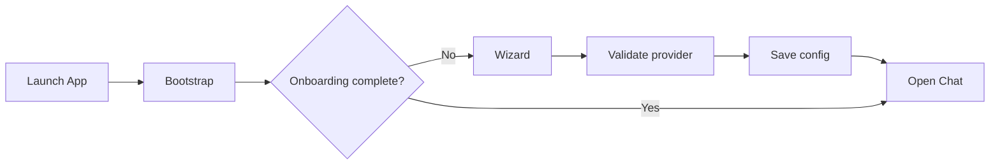
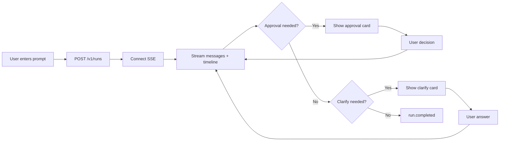

# Hermes Desktop v1.0 UI 设计文档

Date: 2026-04-13

Status: Draft

## 1. 设计目标

Hermes Desktop 的 UI 不是“做一个聊天框”，而是做一个本地 agent 工作台。

UI 需要同时满足三类目标：

1. 降低上手门槛
2. 让 agent 的行为可见、可控
3. 保持 Hermes 现有品牌与视觉语言的一致性

## 2. 视觉方向

桌面版继续沿用现有 `web/` 的 Hermes 视觉语言，不另起一套品牌。

### 2.1 保留项

- 深青绿色背景
- 暖色前景字色
- `Mondwest` / `Collapse` / `Courier Prime` 字体体系
- 轻颗粒噪点与暖色 glow
- 几何边框、网格感导航

### 2.2 调整项

- `Status` 不再是默认首页
- 顶部导航从 dashboard 导航改为“工作台导航”
- 时间线与审批卡片成为一等视觉元素
- 更强调 workspace 与 session 的存在

### 2.3 设计原则

1. 让用户知道 agent 正在做什么。
2. 让用户知道何时需要自己介入。
3. 让高风险动作永远比普通文本更显眼。
4. 让“继续工作”比“查看设置”更近一步。

## 3. 信息架构

### 3.1 一级导航

建议顺序：

1. `Chat`
2. `Sessions`
3. `Logs`
4. `Skills`
5. `Config`
6. `Keys`
7. `Status`

其中：

- `Chat` 为默认页
- `Status` 从首页降级为诊断页

### 3.2 Chat 内部结构

Chat 页采用三列布局：

- 左侧：会话与工作区
- 中间：消息主视图
- 右侧：时间线与运行状态

```text
+--------------------------------------------------------------------------------------+
| Header: Hermes Desktop | Workspace | Model | Run Status | Update Badge | Settings   |
+------------------------+--------------------------------+----------------------------+
| Left Rail              | Main Chat                      | Right Rail                 |
|------------------------|--------------------------------|----------------------------|
| + New Chat             | Session Title                  | Current Run                |
| Search Sessions        | ----------------------------   | - state                    |
|                        | assistant / user messages      | - model                    |
| Recent Sessions        | tool inline summaries          | - elapsed                  |
| - session A            | approval cards                 |                            |
| - session B            | clarify cards                  | Timeline                   |
| - session C            |                                | - thinking                 |
|                        |                                | - tool.started             |
| Workspace chip         | Composer                       | - tool.completed           |
| Approval mode chip     | [textarea..................]   | - approval.required        |
|                        | [Attach] [Stop] [Send]         | - run.completed            |
+--------------------------------------------------------------------------------------+
```

## 4. 关键页面

### 4.1 Onboarding Wizard

#### 页面目标

把“安装后第一次启动”的复杂度压缩成一个短路径。

#### 结构

四步：

1. `Choose Provider`
2. `Enter Credentials`
3. `Pick Model`
4. `Workspace & Approval`

#### 交互要求

- 每步只做一件事
- 有清晰的上一步/下一步
- 所有字段即时校验
- 失败时给出明确错误，而不是泛化 toast

#### 视觉要求

- 不做传统“设置表单页”
- 使用更强的分步感和完成进度
- 完成后直接切到 `Chat`

#### 页面草图

```text
+------------------------------------------------------------------+
| Hermes Desktop                                                   |
| First Run Setup                                      Step 2 of 4 |
|------------------------------------------------------------------|
| Provider: OpenRouter                                             |
|                                                                  |
| API Key                                                          |
| [ *******************************************************      ] |
|                                                                  |
| Base URL (optional)                                              |
| [ https://openrouter.ai/api/v1                                 ] |
|                                                                  |
| Validate credentials before continuing                           |
|                                                                  |
| [Back]                                              [Next Step] |
+------------------------------------------------------------------+
```

### 4.2 Chat 首页

#### 页面目标

让用户尽可能快地进入“提出任务 -> 看到 agent 执行 -> 处理审批/澄清 -> 完成”的主路径。

#### 页面组成

##### 左侧列

- `New Chat`
- Session search
- 最近会话
- 当前工作区
- 当前审批模式

##### 中间列

- 会话标题
- 消息流
- 工具内联摘要
- 审批卡片
- 澄清卡片
- 输入框与发送/停止

##### 右侧列

- 当前 run 摘要
- 时间线
- 失败摘要
- usage 简报

#### 行为要求

- 切换会话时保留滚动位置
- SSE 流期间输入框可继续编辑，但发送按钮变成 `Queue` 或禁用
- 有显式 `Stop` 按钮
- run 结束后自动收起“当前运行”强调态

### 4.3 Sessions Page

#### 页面目标

为重度用户提供更强的历史管理，而不是只依靠 Chat 左栏。

#### 内容

- 会话搜索框
- 结果列表
- 预览摘要
- 删除操作
- 打开会话

#### 视觉要求

- 列表页与 Chat 左栏风格一致
- 支持更长摘要和时间信息

### 4.4 Logs Page

#### 页面目标

在 agent 失败或 runtime 有问题时，用户可以快速定位。

#### 内容

- 日志文件切换
- 最近 N 行
- 高亮错误行
- 可复制诊断信息

#### 不做

- 不做复杂可视化日志分析器
- 不做 Kibana 风格界面

### 4.5 Skills / Config / Keys / Status

这几页沿用现有 Web 管理页结构，但需要：

- 统一导航样式
- 统一标题系统
- 提高与 Chat 页的视觉一致性

## 5. 核心组件设计

### 5.1 Session Sidebar

职责：

- 新建会话
- 切换会话
- 搜索会话
- 展示当前 workspace

每条 session 至少显示：

- 标题
- 最近活跃时间
- 一行 preview
- 当前是否运行中

### 5.2 Message Bubble

消息气泡不是普通 IM 风格，建议更接近“终端工作记录”。

assistant 消息：

- 支持 Markdown
- 代码块有独立边框
- 可以插入工具结果摘要

user 消息：

- 较弱视觉权重
- 更像任务输入卡片

### 5.3 Timeline Panel

这是 Hermes Desktop 的核心差异化组件。

必须支持：

- thinking
- tool start / complete
- approval required / resolved
- clarify required / resolved
- run complete / fail / cancel

每条 timeline item 应包含：

- 图标
- 动作名
- 简短描述
- 时间点
- 可能的耗时

高风险项必须有更高对比度。

### 5.4 Approval Card

#### 目标

让用户在不离开会话上下文的情况下做安全决策。

#### 结构

- 标题
- 风险级别
- 命令预览
- 工作目录
- 影响说明
- 操作按钮

#### 按钮

- `Allow Once`
- `Allow Session`
- `Allow Workspace`
- `Deny`

#### 视觉

- 使用更强边框和警示色
- 避免弹系统 modal 打断阅读流

### 5.5 Clarify Card

#### 目标

让 agent 缺信息时，用户能快速补齐，不把对话拖成模糊来回。

#### 结构

- 问题
- 备选项按钮
- 可选自由输入
- 提交按钮

#### 交互

- 有选项时优先用 chips
- 同时支持手输补充说明

### 5.6 Composer

输入区需要支持：

- 多行输入
- `Enter` 发送 / `Shift+Enter` 换行
- 工作区状态提示
- 发送中状态
- 停止当前 run

可选支持：

- 拖拽文件
- 插入当前选中路径

## 6. 交互流设计

### 6.1 首次启动



### 6.2 发起一次 run



## 7. 状态设计

### 7.1 全局状态

- `booting`
- `ready`
- `degraded`
- `sidecar_restarting`
- `update_available`

### 7.2 会话状态

- `idle`
- `running`
- `waiting_for_approval`
- `waiting_for_clarify`
- `failed`

### 7.3 组件状态

#### Composer

- 默认
- 输入中
- 发送中
- 被禁用

#### Timeline item

- pending
- active
- success
- error
- blocked

## 8. 响应式与窗口行为

Hermes Desktop 主要是桌面应用，但仍需考虑较小窗口。

### 宽屏

- 三列完整展示

### 中等宽度

- 右侧时间线可折叠

### 窄窗口

- 左侧会话栏变抽屉
- 右侧时间线变抽屉

最小推荐宽度：

- `1100px`

最低可用宽度：

- `900px`

## 9. 可访问性

要求：

- 所有交互按钮支持键盘导航
- 审批卡片默认聚焦在主操作区域
- 颜色不能成为唯一状态区分方式
- 输入框、会话项、时间线项有明确 focus ring
- 流式输出区支持屏幕阅读器最小可用朗读

## 10. 文案原则

### 应该

- 具体
- 行动导向
- 对任务状态透明

### 不应该

- 用抽象术语掩盖失败
- 把审批写成模糊提示
- 把 sidecar 错误包装成“未知问题”

示例：

- 好：`Dangerous command requires approval`
- 差：`Something needs your attention`

## 11. 设计 token 建议

延续现有 token：

- `--color-background: #041C1C`
- `--color-foreground: #ffe6cb`
- `--color-card: #062424`
- `--color-warning: #ffbd38`
- `--color-destructive: #fb2c36`

新增建议：

- `--color-timeline-active`
- `--color-timeline-success`
- `--color-timeline-blocked`
- `--color-approval-bg`
- `--color-clarify-bg`

## 12. 页面实现建议

### App.tsx

- 默认页切换为 `chat`
- 顶部保留现有品牌导航语言

### 新增页面

- `ChatPage.tsx`
- `OnboardingPage.tsx`

### 新增组件

- `components/chat/SessionSidebar.tsx`
- `components/chat/MessageList.tsx`
- `components/chat/TimelinePanel.tsx`
- `components/chat/ApprovalCard.tsx`
- `components/chat/ClarifyCard.tsx`
- `components/chat/Composer.tsx`

## 13. v1.0 UI 完成定义

满足以下条件即可认为 UI 达到 v1.0：

1. 用户首启后能通过 Wizard 进入 Chat
2. Chat 页能稳定展示完整 run 流程
3. 时间线能清楚展示工具执行与阻塞点
4. 审批与澄清能在 UI 中完成闭环
5. 历史会话、日志、技能、配置页可正常使用

## 14. 结论

Hermes Desktop 的 UI 核心不是“像别的聊天应用”，而是“让 agent 工作过程变成可被信任的桌面体验”。

因此 v1.0 的 UI 成败标准不是是否炫技，而是三件事：

1. 用户是否能快速开始
2. 用户是否看得懂 agent 在做什么
3. 用户是否能在关键时刻控制 agent
